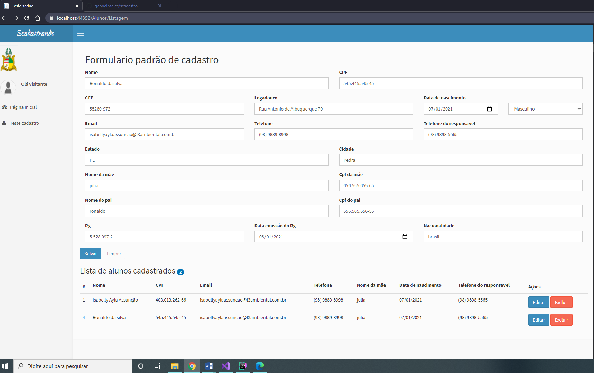
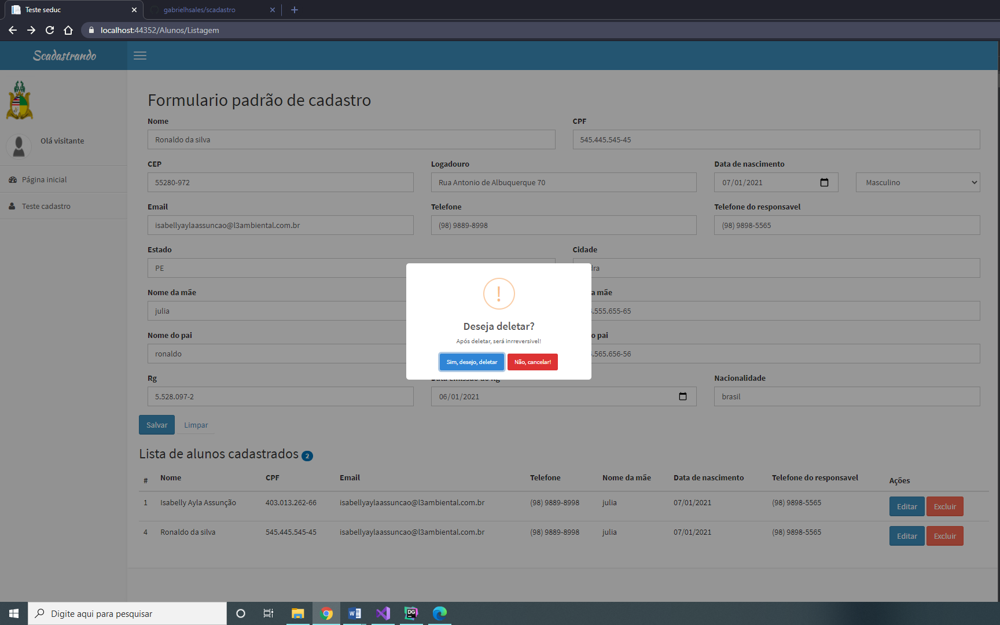

# Scadastro

Projeto de cadastro de aluno e documentos

Tecnologia .Net core 3.1, Sqlite


Caso o arquivo scadastrando.db não exista na pasta:

* Deve possuir o Net core 3.1 instalado na maquina
* Deve possuir o ef core instalado na maquina
* Apos instalados esses itens, está na raiz do projeto e rodar:

```
dotnet ef database update
```

Nesse projeto é utilizado api do viacep para carrega informações do correio

Tela de listagem com as operações para cadastrar, alterar e excluir





Estrutura do banco(relacionamento one to one)


